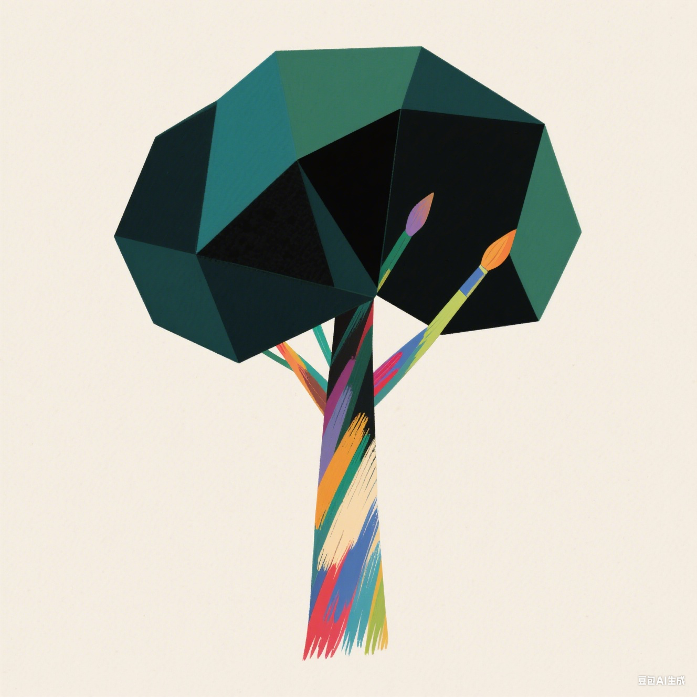

# 🌱 树萌芽の作品集

<div align="center">
  
  
  [](LICENSE)
  [](https://reactjs.org/)
  [](https://flask.palletsprojects.com/)
  [](https://www.python.org/)
  
  **展示创意作品和项目的现代化作品集网站**
</div>

---

### 🚀 功能特点

- 🎨 **清新设计**: 清新可爱的淡绿色配色方案
- 📱 **移动优先**: 完全响应式设计，优先适配手机端
- 🔍 **智能搜索**: 作品搜索和分类筛选功能
- 📦 **多平台支持**: 支持Windows/Android/Linux下载
- 🖼️ **丰富媒体**: 作品截图和视频展示
- 📊 **数据统计**: 浏览量、下载量、点赞量、更新次数统计
- 🛡️ **防刷机制**: 基于用户指纹的智能防刷保护
- 👑 **管理后台**: 完整的后台管理界面
- 📁 **文件管理**: 拖拽上传，支持批量操作
- ⚡ **现代技术栈**: 基于React和Flask构建

### 🛠️ 技术栈

**前端**
- React 18.2.0
- Styled Components
- Axios
- React Router DOM

**后端**
- Python 3.13.2
- Flask 3.0.0
- Flask-CORS

### 📦 快速开始

#### 方式一：使用批处理文件（Windows）

1. **启动后端服务**
   ```bash
   # 双击运行
   start_backend.bat
   ```

2. **启动前端服务**（新开命令窗口）
   ```bash
   # 双击运行
   start_frontend.bat
   ```

#### 方式二：手动启动

1. **后端设置**
   ```bash
   cd backend
   pip install -r requirements.txt
   python app.py
   ```

2. **前端设置**（新开终端）
   ```bash
   cd frontend
   npm install
   npm start
   ```

### 🌐 访问地址

- **前端页面**: http://localhost:3000
- **后端API**: http://localhost:5000
- **管理员界面**: http://localhost:3000/admin?token=shumengya520

### 📁 项目结构

```
树萌芽の作品集/
├── 📂 backend/                 # Flask后端
│   ├── 🐍 app.py              # 主应用程序
│   └── 📋 requirements.txt    # Python依赖
├── 📂 frontend/               # React前端
│   ├── 📂 public/            # 静态资源
│   ├── 📂 src/               # 源代码
│   │   ├── 📂 components/    # React组件
│   │   ├── 📂 services/      # API服务
│   │   ├── ⚛️ App.js         # 主应用组件
│   │   └── 🎯 index.js       # 入口文件
│   └── 📦 package.json       # Node.js依赖
├── 📂 config/                # 配置文件
│   └── ⚙️ settings.json      # 网站设置
├── 📂 works/                 # 作品目录
│   ├── 📁 aicodevartool/     # AI代码变量工具
│   ├── 📁 mengyafarm/        # 萌芽农场
│   └── 📁 mml_cgj2025/       # MML创意游戏大赛2025
└── 📖 README.md              # 本文件
```

### 🔧 API接口

#### 公共API
- `GET /api/settings` - 获取网站设置
- `GET /api/works` - 获取所有作品
- `GET /api/works/{work_id}` - 获取作品详情
- `GET /api/search` - 搜索作品
- `GET /api/categories` - 获取分类
- `POST /api/like/{work_id}` - 点赞作品

#### 管理员API（需要token）
- `GET /api/admin/works` - 管理员获取作品
- `POST /api/admin/works` - 创建新作品
- `PUT /api/admin/works/{work_id}` - 更新作品
- `DELETE /api/admin/works/{work_id}` - 删除作品
- `POST /api/admin/upload/{work_id}/{file_type}` - 上传文件

### 👨‍💻 开发

1. **克隆仓库**
   ```bash
   git clone <repository-url>
   cd 树萌芽の作品集
   ```

2. **按照上面的快速开始指南操作**

3. **使用token访问管理员面板**: `shumengya520`

### 📄 许可证

本项目采用 MIT 许可证 - 查看 [LICENSE](LICENSE) 文件了解详情。

### 📋 作品配置格式

每个作品需要在 `works/{作品ID}/` 目录下包含：

- `work_config.json` - 作品配置文件
- `image/` - 作品截图目录
- `platform/` - 各平台文件目录
- `video/` - 作品视频目录（可选）

#### work_config.json 示例

```json
{
  "作品ID": "example",
  "作品作品": "示例作品",
  "作品描述": "这是一个示例作品的描述",
  "作者": "树萌芽",
  "作品版本号": "1.0.0",
  "作品分类": "工具",
  "作品标签": ["示例", "工具"],
  "上传时间": "2025-01-01T00:00:00",
  "更新时间": "2025-01-01T00:00:00",
  "支持平台": ["Windows", "Android"],
  "文件名称": {
    "Windows": ["example_windows.zip"],
    "Android": ["example_android.apk"]
  },
  "作品截图": ["image1.jpg", "image2.jpg"],
  "作品视频": [],
  "作品封面": "image1.jpg",
  "作品下载量": 0,
  "作品浏览量": 0,
  "作品点赞量": 0,
  "作品更新次数": 0
}
```

### 🔧 管理员功能

#### 访问管理员界面

1. 确保后端和前端服务都已启动
2. 访问: http://localhost:3000/admin?token=shumengya520
3. 管理员token: `shumengya520`

#### 主要功能

1. **作品管理**
   - ✅ 查看所有作品列表
   - ➕ 添加新作品
   - ✏️ 编辑作品信息
   - 🗑️ 删除作品

2. **文件管理**
   - 📸 作品截图上传（PNG、JPG、JPEG、GIF）
   - 🎥 作品视频上传（MP4、AVI、MOV）
   - 📦 平台文件上传（ZIP、RAR、APK、EXE、DMG）
   - 🖼️ 封面图片选择
   - 📤 拖拽批量上传
   - 🗑️ 单独文件删除

3. **统计功能**
   - 📊 实时数据统计
   - 🛡️ 防刷机制保护
   - 👍 用户互动统计

### 🛡️ 防刷机制说明

- **用户识别**: 基于IP地址和User-Agent生成用户指纹
- **时间限制**:
  - 浏览量：1分钟内同一用户同一作品只计数一次
  - 下载量：5分钟内同一用户同一作品只计数一次
  - 点赞量：1小时内同一用户同一作品只计数一次
- **自动更新**: 管理员编辑作品时自动增加更新次数

### 🤝 贡献

欢迎提交Issue和Pull Request来改进这个项目！

### 👨‍💻 作者

**树萌芽** - [3205788256@qq.com](mailto:3205788256@qq.com)


---

<div align="center">
  <p>Made with ❤️ by 树萌芽</p>
  <p>如果这个项目对你有帮助，请给它一个 ⭐️</p>
</div>
